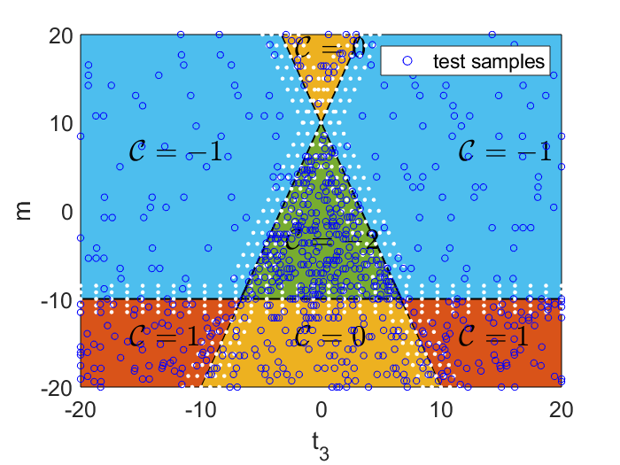

# Quantum_TP_Identification_DNN

This repo contains the code and supplemented documents for the paper "Quantum topology identification with deep neural networks and quantum walks" that was published on NPJ computational materials.

The readers are free to use, modify and distribute the corresponding code and documents without the authors' consent, however it will be appreciate the paper could be cited.

This repo mainly consists of four parts: 1. the Matlab scripts for generating the data; 2. the tools for preparing the data complying with format of TensorFlow, which is a Deep Learning library open-sourced by Google; 3. the python code for doing the experiment, like model training and testing, as well as scripts for analysing the results; 4. supplemented documents for easing understanding of corresponding work.

1. preliminary

We provide a very general introduction to the neural networks in the documents folder. The readers with background of physics are encouraged to read it to understand the principle of back-propagation or error-propagation. Also, an intuitive summary to the success of Deep Learning is not too bad: In conventional image processing, we tend to design filters for specific problems. By using neural network, this process can be automated. And such a highly non-linear process can find its support in mammalian's visual system.

The libraries we used to construct the neural network are TensorFlow and Sonnet. TensorFlow is an open-sourced machine learning library developed by Google Brain team especially taking consideration of Deep Learning. With backend computation engien implemented in C++ and Python interface, it is powerful and flexible. Sonnet is developed and open-sourced by DeepMind. It is a high-level abstraction of TensorFlow and more user-friendly via its modular philosophy. There are intensive textbooks published giving tutorial on TensorFlow.

2. data preparation

For data generationg, please refer to the Matlab script DATA_GEN.m.
The raw data bearing the quantum state information cannot be directly consumed by the neural network especially from the effectiveness perspective. It has to be converted into the format called TF records required by TensorFlow.

Due to the size of raw data, we cannot load all data once for all in the memory then shuffle the data for training, validation and test respectively. We do this in an indirect way: we manipulate with the filenames, and based on the filenames to generate corresponding sets. The file in fulfilling this purpose is data_prep.py. Note it is a hybrid programming of Python and Matlab, the users have to follow the  <a href="https://au.mathworks.com/help/matlab/matlab-engine-for-python.html">steps</a> to integrate Matlab into Python environment. 

If the users are intended to investigate the distribution of sets for training, validation and test respectively, please use the files: filename_py2mat.py, train_dist.m, val_dist.m and test_dist.m. A case for test set distribution is demonstrated as below:

After the above procedures, TF records files can be generated by invoking tfr_gen_momentum.py or tfr_gen_position.py. The version of TensorFlow for this work is 1.12.

If a individual sample (momentum/position) needs to be generated for special considerations, the files tfr_gen_momentum_individual.py and tfr_gen_position_individual.py can be referred to.

3. neural network 

The files about construction and configuration of neural network, related training and testing scritps resides in the dnn-som folder. The README.txt file does it best to give functionalities of individual files. Some files are not well-documented, however, from README.txt and the python source code itself, the purpose is easy to grasp.

For the sake of clarity, bash scripts are grouped into another folder called "scripts". Individual script file needs to be moved or copied into dnn-som folder before running.

(we will upload in a procedural way, the whole uploading process might take couple of weeks at longest.)

